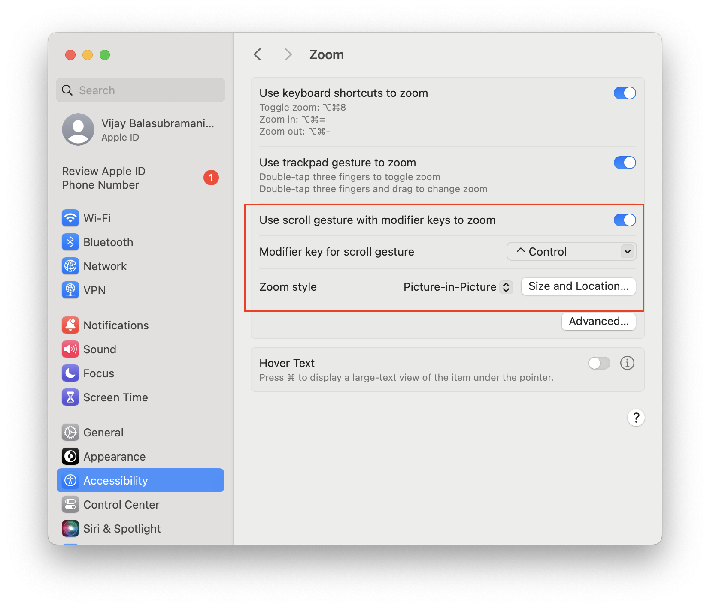
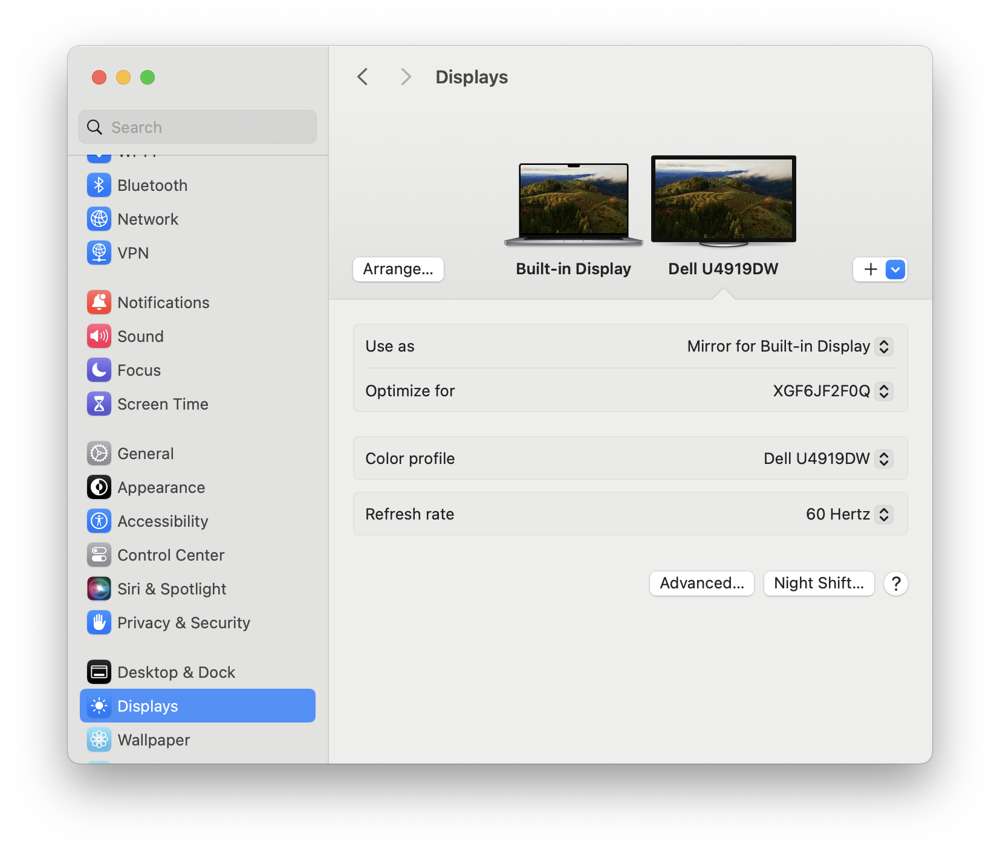
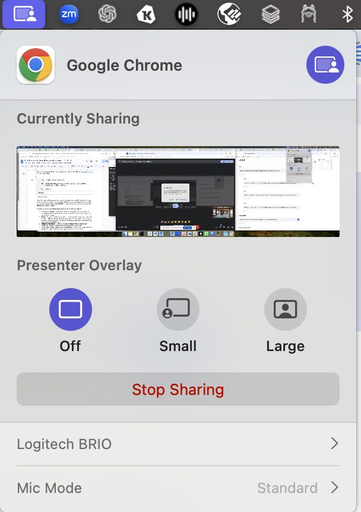
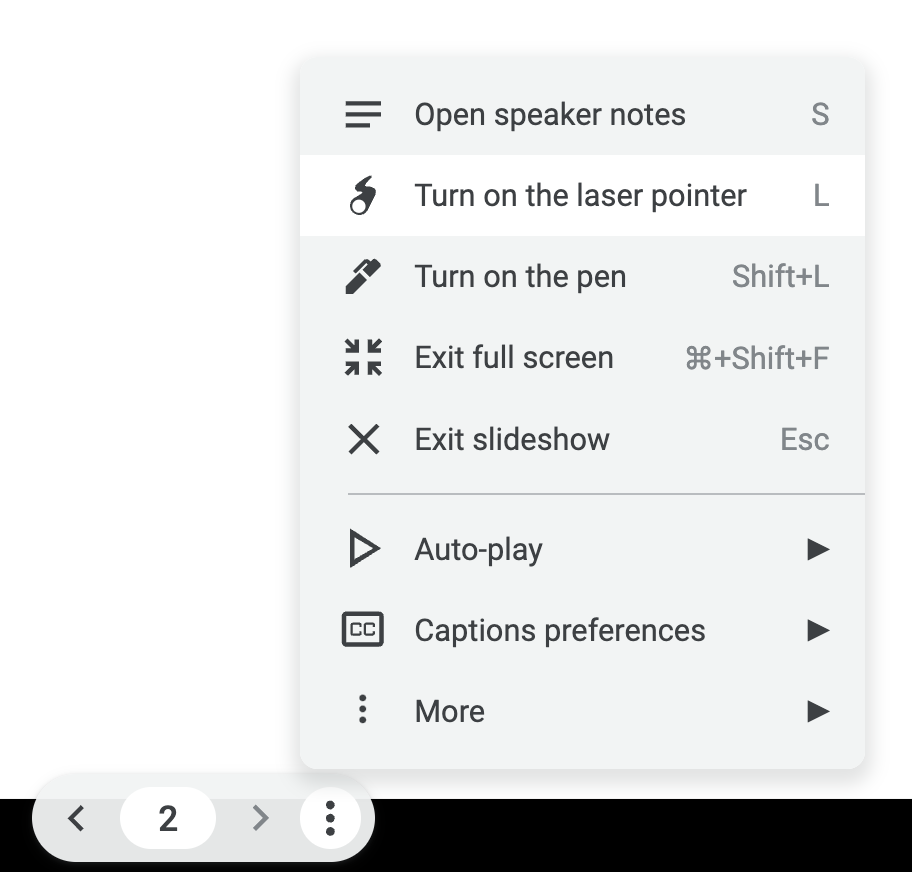

# demo-tips

To deliver a compelling demo, it is useful to be able to draw the audience's attention to specific parts of the screen as you talk about them.

A couple of methods to achieve this are:

1. Zoom in on the part of the screen you want to draw attention to
2. Use a laser pointer

Assuming you are presenting on a videoconferencing platform such as Zoom or Google Meet, here is how you can do it:

### Zoom in
This requires setting up Accessibility in Mac's System settings. 

Be sure to set:
- Use scroll gesture with modifier keys to zoom in
- Modifier key: Control
- Zoom style: Picture in Picture
- Click on Size and Location, and increase the size to cover the entire screen

Now when you share your screen in Zoom or Google Meet, share your entire desktop. If you are using multiple displays, make sure to set the secondary display to mirror the built-in display.

Then use the Control+Scroll gesture on the mouse to zoom in on the part of the screen you want to draw attention to. You can also pan around the screen by moving the mouse.

On Google Meet, there is an additional step needed to workaround an issue. By default, Google Meet will not show the zoomed in effect to the audience. 

Workaround: Choose the icon on the top bar. Change the Presenter Overlay to Small and back to Off. Now the zoomed in effect will be visible to the audience.

### Laser pointer

Zoom has a built-in laser pointer feature that becomes available when you share your screen. It also lets you draw on the screen.

With Google Meet, there is no built-in laser pointer feature. As a workaround, you can use the laser pointer feature in Google Slides, and move your mouse around in other applciations.

To access Google Slides' laser pointer, switch to presentation mode and choose from the options in the bottom left corner of the screen.

